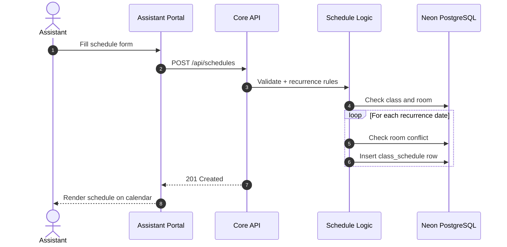
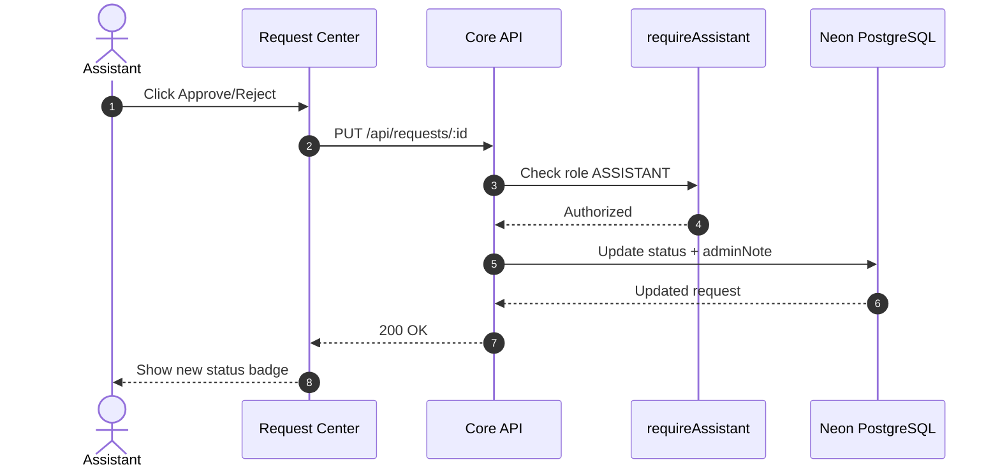
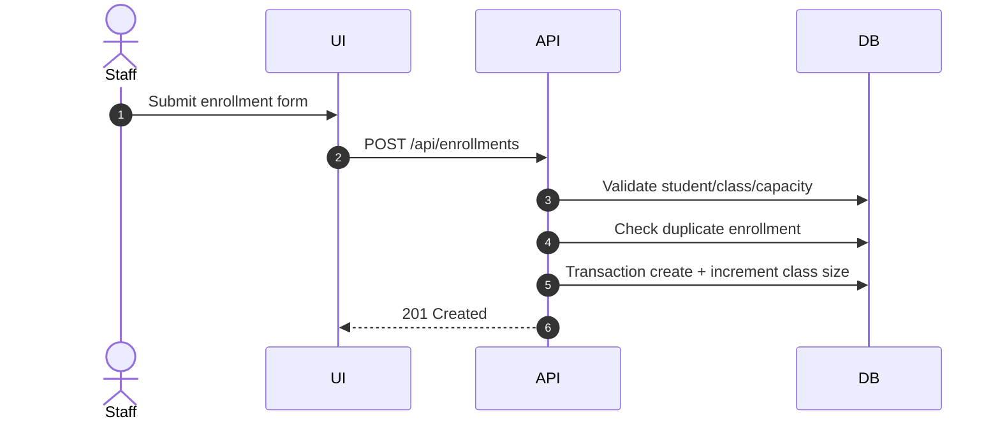

# ALL INFO – WEB PART DEFENSE GUIDE (USTH Academic Suite)

> Mục tiêu tài liệu: giúp bạn trình bày **toàn bộ phần Web** khi bảo vệ đồ án, từ kiến trúc, chức năng, database, API, sequence diagram, test flow, rủi ro và hướng phát triển.

---

## 1. Project Overview

### 1.1 Bài toán
Hệ thống quản lý đào tạo cần giải quyết các vấn đề:
- Quản lý phân tán (môn học, lớp học, phòng học, lịch học, yêu cầu giảng viên).
- Thiếu quy trình chuẩn cho duyệt request.
- Khó theo dõi lịch học/lịch thi trên cùng cơ sở dữ liệu.
- Cần dashboard tổng hợp để trợ lý đào tạo quyết định nhanh.

### 1.2 Mục tiêu của phần Web
- Xây dựng cổng quản trị cho **Academic Assistant**.
- Quản lý đầy đủ nghiệp vụ: users, subjects, classes, rooms, schedules, requests.
- Hiển thị lịch trực quan và phân biệt được **Study vs Exam**.
- Hỗ trợ phê duyệt yêu cầu nhanh, theo dõi trạng thái rõ ràng.

### 1.3 Phạm vi bạn phụ trách (Web)
- Frontend (React + TypeScript + Vite).
- Tích hợp API từ Core Service.
- Luồng auth + role-based UI.
- UX cho Request Center, Scheduling, Student Schedule.

---

## 2. System Architecture

## 2.1 Kiến trúc tổng thể

```text
Frontend (React, Port 5173)
        |
        | REST API
        v
Core Service (Express, Port 4000) ---- Prisma ---- Neon PostgreSQL
        |
        +---- Firebase Admin (token verify)

Realtime Service (Port 5002) ---- Firestore (notifications/live updates)
```

### 2.2 Vai trò từng tầng
- **Frontend**: render giao diện, validate cơ bản, gọi API, hiển thị dữ liệu nghiệp vụ.
- **Core Service**: xử lý business rules, xác thực quyền, transaction DB, trả JSON cho frontend.
- **Neon PostgreSQL**: lưu dữ liệu chuẩn hóa quan hệ.
- **Realtime Service + Firestore**: notification realtime và room status events.

### 2.3 Lý do chọn kiến trúc này
- Tách concern rõ: UI / nghiệp vụ / dữ liệu / realtime.
- Core API là single source of truth cho business rules.
- Scale linh hoạt hơn cho realtime mà không ảnh hưởng CRUD chính.

---

## 3. Technology Stack

### Frontend
- React 18
- TypeScript
- Vite
- Zustand (auth state)
- TailwindCSS (UI)

### Backend
- Node.js + Express
- Prisma ORM
- Zod validation
- Firebase Admin (verify token)

### Database
- Neon PostgreSQL (serverless)

---

## 4. Module Breakdown (Web)

Trong Assistant Portal, các nhóm chức năng chính:

1. **Master Data**
   - User Management
   - Subject Management
   - Class/Semester Management

2. **Scheduling & Resources**
   - Room Management
   - Scheduling Board (tạo/cập nhật lịch)
   - Student Schedule (calendar, chi tiết lịch)

3. **Request Center**
   - Danh sách request
   - Phê duyệt / từ chối
   - Hiển thị trạng thái PENDING / APPROVED / REJECTED

4. **Common**
   - Profile modal
   - Notification panel

---

## 5. Functional Requirements (Web-centric)

## 5.1 Authentication & Profile
- Login email/password.
- Firebase login.
- Register account (theo role).
- Change password / forgot password.
- Hiển thị profile user sau đăng nhập.

## 5.2 User Management
- Xem danh sách users, lọc theo role.
- Tạo user mới.
- Cập nhật role.
- Reset password (admin flow).

## 5.3 Subject Management
- Xem danh sách môn.
- Tạo môn đơn lẻ hoặc bulk.
- Sửa/xóa môn.
- Chặn xóa môn nếu còn class liên quan.

## 5.4 Class Management
- Tạo lớp theo môn, giảng viên, kỳ học.
- Validate lecturer phải đúng role.
- Validate date range hợp lệ.
- Chặn xóa lớp nếu đã có enrollment/schedule.

## 5.5 Scheduling
- Tạo lịch 1 buổi hoặc recurring (daily/weekly/monthly/weekday set).
- Kiểm tra conflict phòng trước khi ghi DB.
- Lưu loại lịch (`type`: MAIN/MAKEUP/EXAM).
- Lưu phân loại lịch (`category`: STUDY/EXAM).

## 5.6 Enrollment
- Ghi danh sinh viên vào lớp.
- Kiểm tra class active, capacity, duplicate.
- Transaction cập nhật đồng thời enrollment + currentEnrollment.

## 5.7 Request Center
- Xem danh sách request.
- Duyệt / từ chối request (assistant).
- Ghi chú adminNote.
- Phản ánh trạng thái realtime trên UI sau thao tác.

## 5.8 Analytics
- Dashboard tổng hợp users/classes/enrollments/requests/schedules.
- Hỗ trợ quyết định vận hành nhanh.

---

## 6. Database Design (Important for Defense)

## 6.1 Các bảng lõi
- `user`
- `subject`
- `class`
- `room`
- `class_schedule`
- `enrollment`
- `request`
- `notification`
- `attendance`
- `grade_item`
- `grade_record`

## 6.2 Quan hệ chính
- Subject 1-n Class
- Class 1-n ClassSchedule
- Class n-n Student thông qua Enrollment
- User (Lecturer) 1-n Class
- Request n-1 User (sender)

## 6.3 Điểm mới quan trọng: phân biệt lịch học/lịch thi
Trong `class_schedule` đã có:
- `type`: MAIN / MAKEUP / EXAM
- `category`: STUDY / EXAM

Ý nghĩa:
- `category = STUDY` -> lịch học
- `category = EXAM` -> lịch thi

Điều này giúp người dùng khác dùng chung DB vẫn phân biệt rõ loại lịch.

---

## 7. API Surface (Web sử dụng trực tiếp)

### Auth
- `POST /api/auth/login`
- `POST /api/auth/register`
- `POST /api/auth/firebase-login`
- `POST /api/auth/forgot-password`
- `POST /api/auth/change-password`

### Core entities
- Users: `/api/users`
- Subjects: `/api/subjects`
- Classes: `/api/classes`
- Rooms: `/api/rooms`
- Schedules: `/api/schedules`
- Enrollments: `/api/enrollments`
- Requests: `/api/requests`
- Notifications: `/api/notifications`
- Analytics: `/api/analytics/dashboard`

### Health
- `GET /health`

---

## 8. Sequence Diagrams (for report)

> Gợi ý: trong báo cáo bạn chỉ cần chọn 2–3 sequence tiêu biểu, không cần nhồi quá nhiều.

## 8.1 Create Recurring Schedule



## 8.2 Approve / Reject Request



## 8.3 Enrollment Creation



---

## 9. Validation & Business Rules You Should Emphasize

1. **Date rules**: end > start (class & schedule).
2. **Role rules**: assistant-only endpoints phải qua middleware.
3. **Conflict rules**: không cho trùng phòng theo time overlap.
4. **Capacity rules**: không cho enroll quá maxCapacity.
5. **Consistency rules**: transaction cho các thao tác cập nhật nhiều bảng.
6. **Duplicate rules**: chặn trùng subject/class/enrollment.

---

## 10. Testing Strategy (What to say in defense)

## 10.1 Manual test theo use-case
- Create subject -> create class -> create recurring schedule.
- Add student enrollment đến ngưỡng full.
- Approve/reject requests và kiểm tra status đổi đúng.

## 10.2 API-level checks
- 400 cho invalid payload.
- 409 cho business conflict.
- 404 cho resource not found.
- 500 cho unexpected failure.

## 10.3 Regression focus
- Request approval flow.
- Recurring schedule generation.
- Enrollment consistency (`currentEnrollment`).

---

## 11. Security & Current Limitations

### Hiện tại
- Một số endpoint đang dựa vào `x-user-id` để kiểm tra quyền nhanh trong dev.

### Kế hoạch chuẩn production
- Verify JWT/Firebase token bắt buộc ở middleware.
- Chuẩn hóa RBAC toàn bộ routes.
- Audit log thao tác quan trọng (approve request, schedule changes).

---

## 12. Deployment Notes (Neon)

- Dùng `DATABASE_URL` trỏ Neon (`sslmode=require`).
- Chạy migration:

```bash
cd services/core
npx prisma migrate deploy
npx prisma generate
```

- Kiểm tra cột phân biệt lịch học/lịch thi:

```sql
SELECT id, type, category, "startTime", "endTime"
FROM class_schedule
ORDER BY "startTime" DESC;
```

---

## 13. Defense Script (1–2 phút mở đầu)

"Đề tài của em tập trung vào số hóa vận hành đào tạo ở góc nhìn trợ lý đào tạo. Em thiết kế hệ thống Web theo kiến trúc tách frontend, core API và realtime. Core API quản lý toàn bộ business rules và lưu dữ liệu trên Neon PostgreSQL bằng Prisma. Phần em làm nổi bật ở ba mảng: quản lý học vụ (subject/class/user), xếp lịch thông minh có kiểm tra conflict và lịch lặp, và Request Center để duyệt yêu cầu tập trung. Em cũng bổ sung cơ chế phân loại lịch bằng cột category trong class_schedule để phân biệt rõ lịch học và lịch thi khi nhiều người dùng chung một database."

---

## 14. Q&A Quick Bank (giám khảo hay hỏi)

1. **Tại sao cần cả `type` và `category` cho schedule?**  
`type` mô tả nghiệp vụ chi tiết (MAIN/MAKEUP/EXAM), còn `category` giúp phân nhóm hiển thị/analytics đơn giản (STUDY/EXAM).

2. **Vì sao kiểm tra conflict ở backend thay vì frontend?**  
Để đảm bảo đúng khi nhiều client thao tác đồng thời.

3. **Tại sao dùng transaction ở enrollment/schedule?**  
Để tránh dữ liệu nửa chừng, đảm bảo atomicity.

4. **Nếu scale lớn hơn thì tối ưu đâu trước?**  
Index theo roomId/startTime/endTime, phân trang, cache dashboard, tách background jobs.

---

## 15. Kết luận

Phần Web của bạn đã đạt đủ các khối cho một hệ thống học vụ thực tế:
- Có kiến trúc rõ ràng.
- Có functional coverage đầy đủ.
- Có luồng dữ liệu/sequence giải thích được.
- Có business rules, validation, transaction.
- Có hướng mở rộng production rõ ràng.

Bạn có thể dùng tài liệu này làm “xương sống” để trình bày và phản biện.
